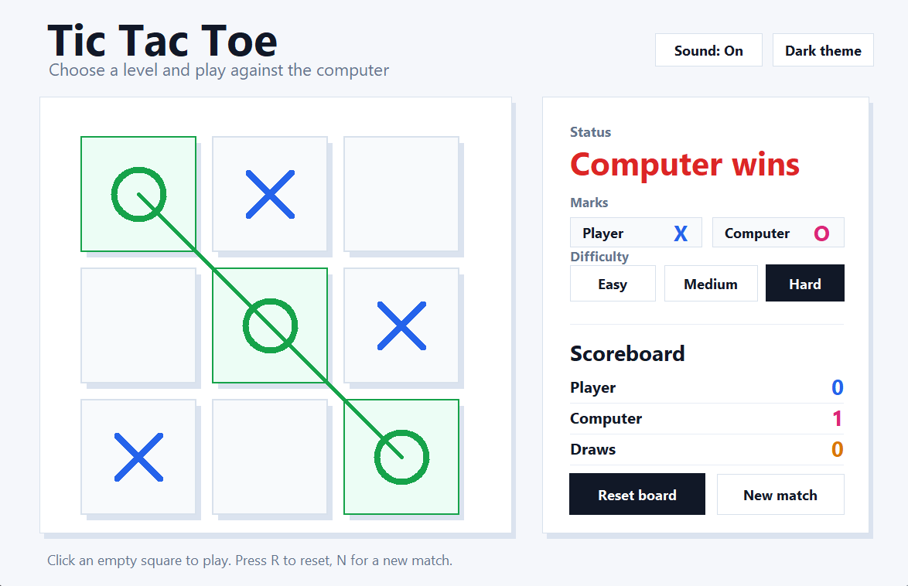
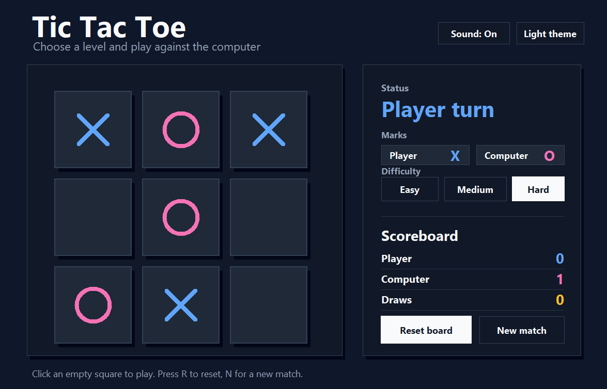
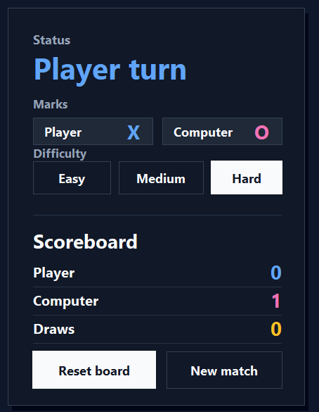
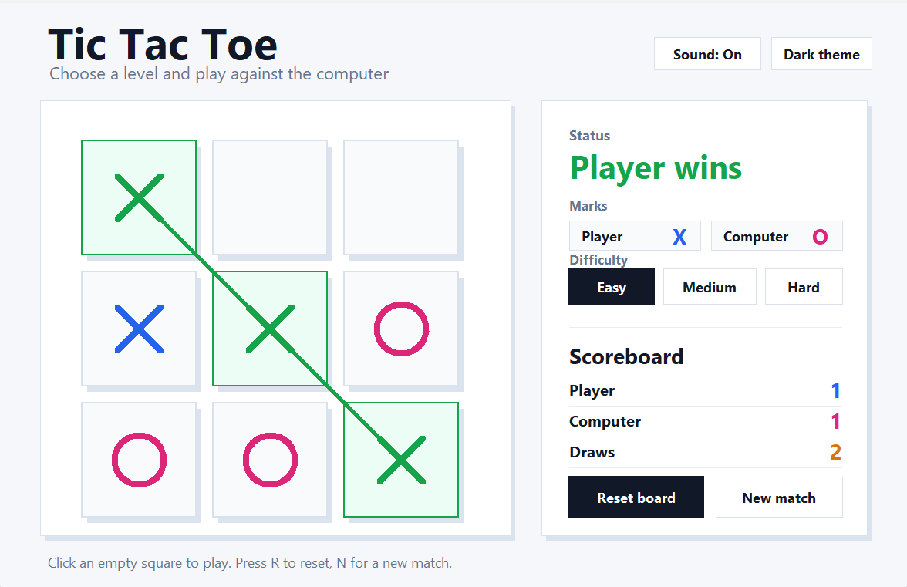

# Tic Tac Toe AI

A clean, playable Tic Tac Toe desktop game built with Python. The project includes a polished Tkinter interface, three computer difficulty levels, score tracking, light/dark themes, and optional sound effects.

## Features

- Clean desktop UI built with Python Tkinter
- Easy, Medium, and Hard difficulty modes
- Player vs Computer gameplay
- Light and dark theme toggle
- Sound toggle for move, win, lose, and draw feedback
- Scoreboard for Player, Computer, and Draws
- Reset board and new match controls
- No third-party packages required

## Built With

| Category | Technology |
|---|---|
| Language | Python |
| GUI library | Tkinter |
| Sound | `winsound` on Windows, Tkinter bell fallback on other systems |
| Randomized moves | Python `random` module |
| Type hints | Python built-in type annotations |
| Dependencies | Python standard library only |

## Algorithms and Logic

- Game-tree search is used for the strongest computer difficulty.
- Alpha-beta pruning improves the search by skipping branches that cannot change the final decision.
- Easy mode chooses a random available move.
- Medium mode checks for immediate winning moves, blocks immediate player wins, then chooses a strong square.
- Hard mode evaluates future game states and picks the best move.
- Win detection checks all rows, columns, and diagonals after every move.
- The board is stored as a 1D list of 9 cells, which keeps the UI and logic simple to connect.

## How It Is Built

The project is split into separate files so the interface and game rules stay clean:

- `main.py` launches the game.
- `game_ui.py` handles the desktop window, board drawing, clicks, themes, sound, score display, and controls.
- `game_logic.py` handles board creation, move validation, winner detection, difficulty behavior, and computer move selection.

This separation makes the code easier to understand, test, and extend. The UI calls functions from the logic file instead of rewriting game rules inside the interface.

## Screenshots

The game opens as a desktop window with:

- A 3 x 3 game board on the left
- Status, marks, difficulty, scoreboard, and controls on the right
- Theme and sound controls in the header

Add screenshots in the `assets/screenshots/` folder using these file names:

| Screenshot | File path | What to capture |
|---|---|---|
| Light theme gameplay | `assets/screenshots/light-theme-gameplay.png` | Main game window in light theme with a few moves played |
| Dark theme gameplay | `assets/screenshots/dark-theme-gameplay.png` | Same game window after switching to dark theme |
| Difficulty controls | `assets/screenshots/difficulty-controls.png` | Easy, Medium, and Hard buttons visible in the side panel |
| Winning state | `assets/screenshots/winning-state.png` | Final board with a winning line and updated status |

When screenshots are added at these paths, GitHub will render them here:









## Project Structure

```text
.
|-- main.py
|-- game_ui.py
|-- game_logic.py
|-- assets/
|   `-- screenshots/
|-- requirements.txt
|-- LICENSE
`-- README.md
```

## How to Run

Make sure Python 3.10 or newer is installed.

```bash
python main.py
```

You can also run the UI file directly:

```bash
python game_ui.py
```

## Controls

- Click an empty square to place `X`
- Press `R` to reset the current board
- Press `N` to start a new match
- Use the Sound button to turn sound on or off
- Use the Theme button to switch between light and dark mode
- Choose Easy, Medium, or Hard before or during a match

## Difficulty Levels

- Easy: Chooses from available moves randomly
- Medium: Looks for immediate wins and blocks immediate threats
- Hard: Uses the strongest available decision strategy

## Requirements

This project uses only Python's standard library.

- Python 3.10+
- Tkinter, included with most Python installations

## Author

M. Mansoor Ur Rehman

GitHub: [imnxr](https://github.com/imnxr)

## License

This project is licensed under the MIT License.
